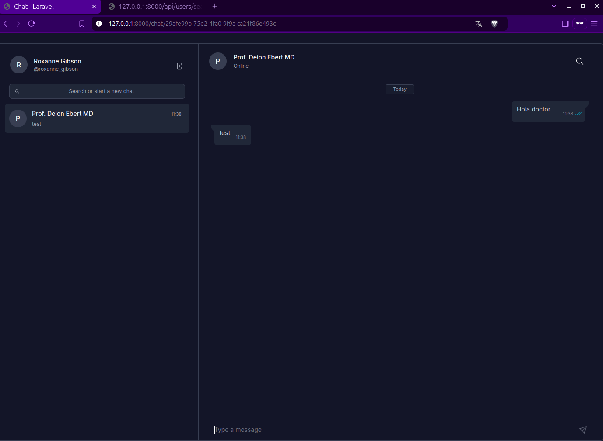

## Laravel Chat App


## Installation and Usage

Clone the repository

Go to the project directory

```bash
cd laravel-chat-app
```

Install dependencies

```bash
# composer
composer install

# npm
npm install
```

Copy `.env.example` to `.env`

```bash
cp .env.example .env
```

Generate application key

```bash
php artisan key:generate
```

Run migration and seeder

```bash
# migration
php artisan migrate

# seeder
php artisan db:seed
```


Install Soketi

```bash
npm install -g @soketi/soketi
```

Run Soketi with custom configuration.

```bash
soketi start --config=soketi.config.json
```

Run the application

```bash
# Start the development server
php artisan serve

# Run React JS
npm run dev
```

## Screenshots
### to start you can go to api
```bash
# go to the api
http://127.0.0.1:8000/api/users/search
```
take two users copy the emails and go to the login page
http://127.0.0.1:8000/login


# Go to search chat or create chat

### search the user by name and start to chat




